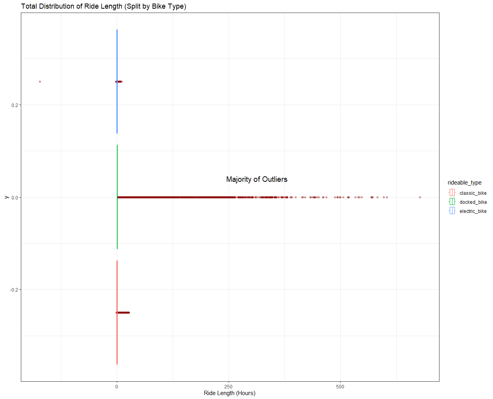
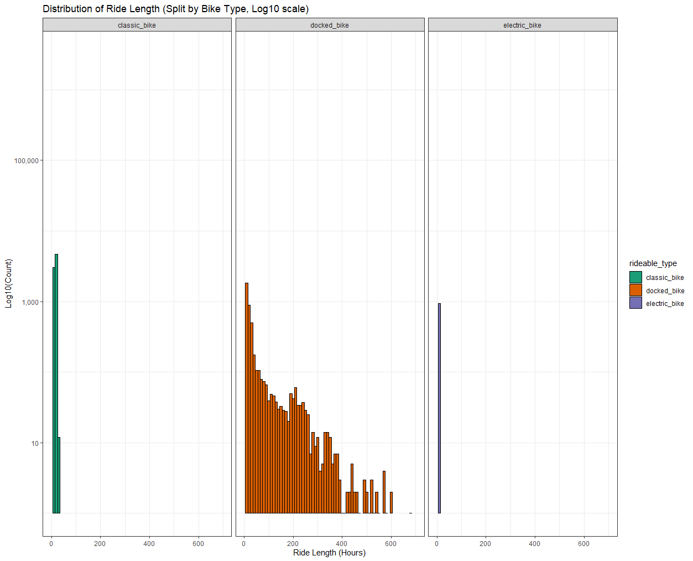
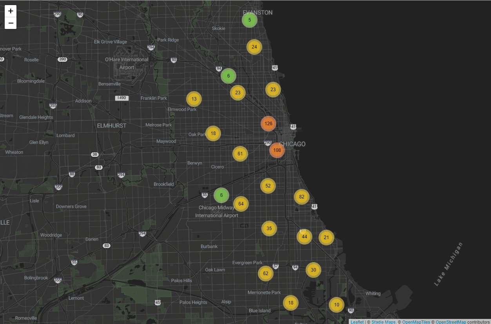
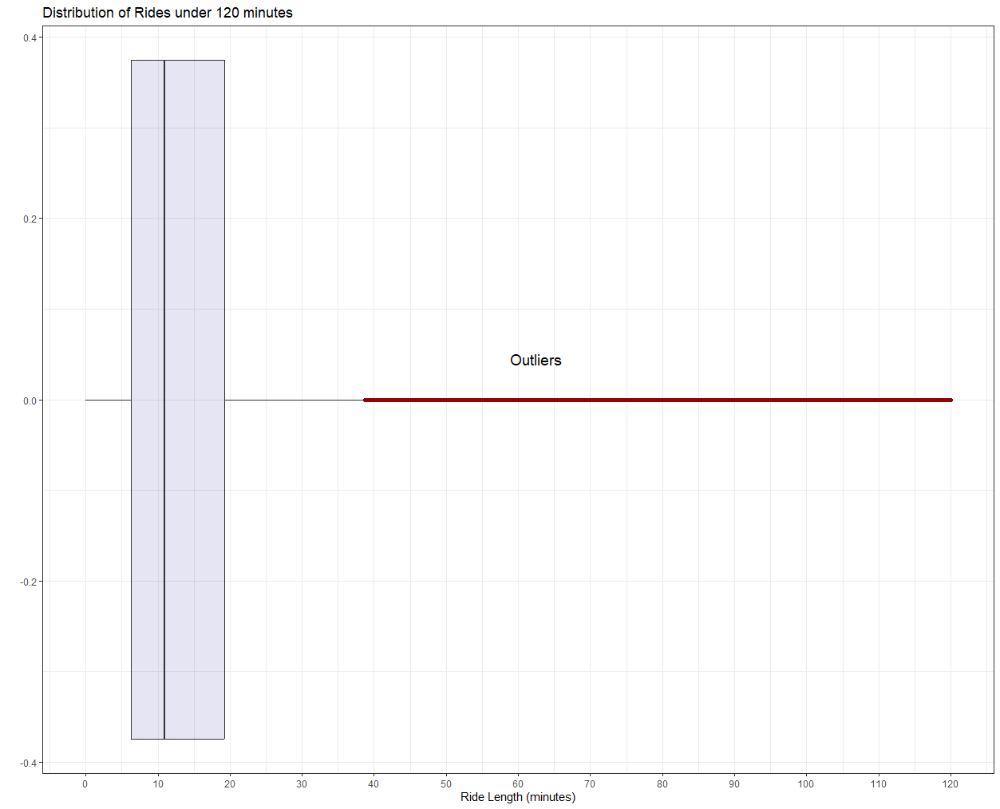
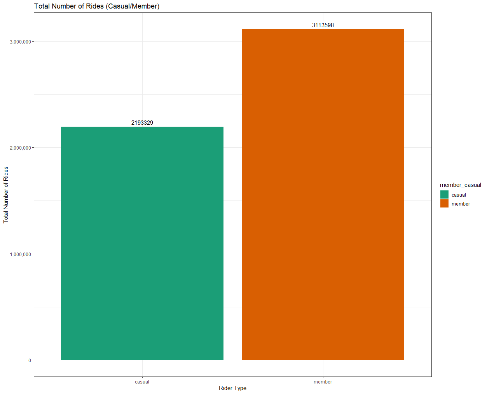
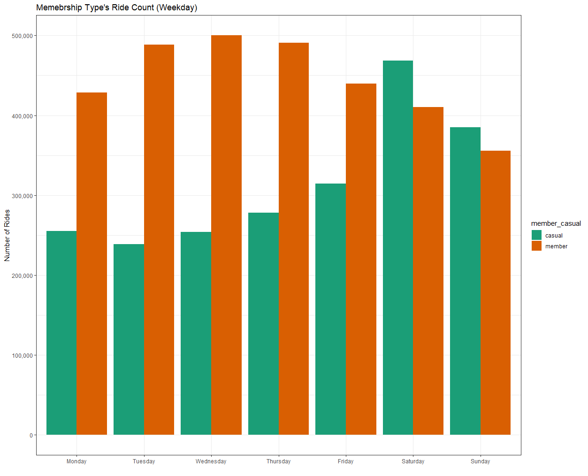
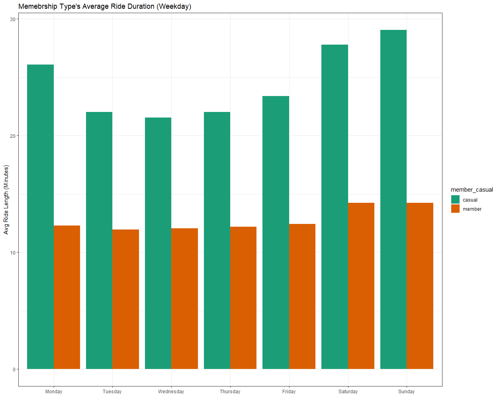
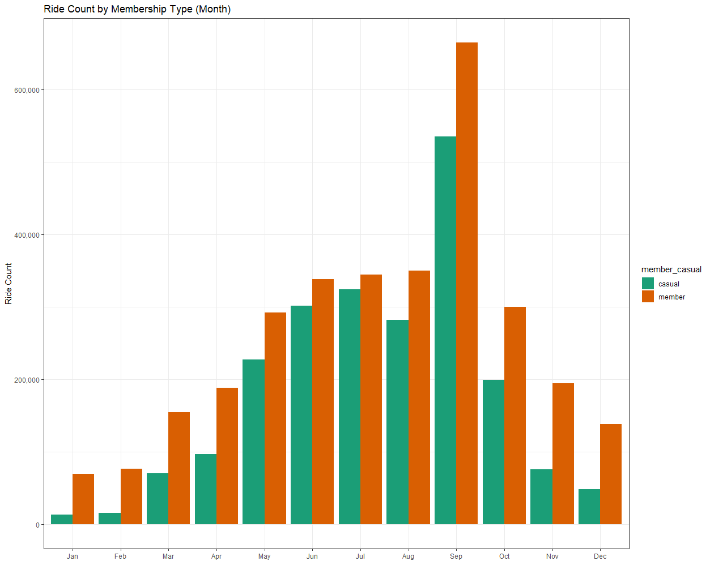
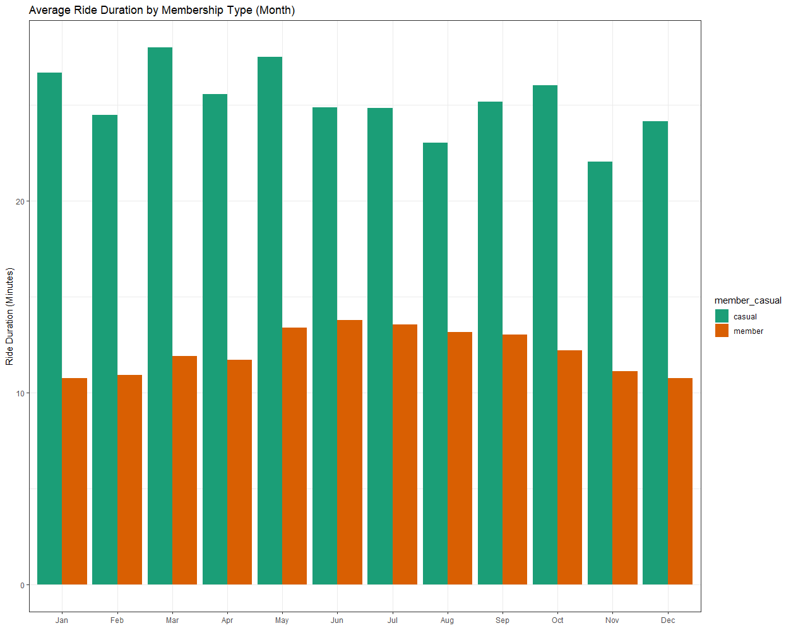

# Cyclistic Bike Share Analysis


- - - - - - - - - - - - - - - - - - - - - - - - - - - - - - - - - - - - - - - - - - - - - - - - - - - - - - - - - - 
# Introduction
This repository contains an analysis of **Cyclistic**, a fictional bike-share company based in Chicago. The overall objective is to uncover insights to develop a marketing strategy to convert casual riders into annual members. By analyzing Cyclistic’s bike trip data, we aim to understand how different types of customers use the service and identify opportunities to encourage casual riders to purchase annual memberships.

### The analysis will seek to answer the following questions:
1. What are the general riding behaviors of our riders?
2. What are the differences between member and casual riders?
3. Is there a notable difference between our members and casual riders week by week?
4. How does rider behaviour change month to month?
- - - - - - - - - - - - - - - - - - - - - - - - - - - - - - - - - - - - - - - - - - - - - - - - - - - - - - - - - - 
# Tools
- **Excel**: For CSV management
- **Git/GitHub**: For version control and uploading my findings
- **R**: For data wrangling, analysis, and visualization
- **RStudio**: The primary enviornment used for scripting


- - - - - - - - - - - - - - - - - - - - - - - - - - - - - - - - - - - - - - - - - - - - - - - - - - - - - - - - - - 
# Data Source
The analysis is based on **Cyclistic’s** trip data, which includes information about each ride taken with the service over the past year. The dataset covers various aspects of the rides, such as start/end times, station names, ride length, and user type (casual or member). The data was provided as part of the Google Data Analytics Professional Certificate capstone project. You can access the updated data souce [here](https://divvy-tripdata.s3.amazonaws.com/index.html) or within the [data folder](data) of this repository.


- - - - - - - - - - - - - - - - - - - - - - - - - - - - - - - - - - - - - - - - - - - - - - - - - - - - - - - - - - 
# Data Preparation and Cleanup
The script includes steps for loading, cleaning, and preparing the data for analysis. This involves merging multiple CSV files, handling missing values, and creating new variables for analysis.


## Load Libraries #################################################
To start with, we load the necessary libraries for our analysis. These libraries provide functions for data manipulation, visualization, and spatial analysis.
```r
library(geosphere)
library(leaflet)
library(leaflet.extras)
library(tidyverse)
theme_set(theme_bw())
```


## Importing Data #################################################
The data was originally divided into 13 CSV files, which were merged using the following code. This process involves importing the files into a list, evaluating their structure, and combining them into a single data frame. The data was then verified to be structurally sound before proceeding with the analysis.

Key things to note:
- There are no duplications for the primary key
- There is a total of 6,584,382 rows
``` r
# Load all the trip files into a list
triplist <- list.files(pattern = "*.csv")

# Import data
all_trips <- map(triplist, read_csv)

# Evaluate the data structure before merging the list
glimpse(all_trips)

# Combine data into a single data frame
all_trips <- bind_rows(all_trips)

# Verify ride_id is a unique primary key
anyDuplicated(all_trips$ride_id)

# Re-evaluate structure
head(all_trips)
summary(all_trips)
str(all_trips)
View(all_trips)
```
#### Preview of all_trips Dataframe

| ride_id         | rideable_type | started_at          | ended_at            | start_station_name | start_station_id | end_station_name | end_station_id | start_lat | start_lng | end_lat  | end_lng  | member_casual |
|-----------------|---------------|---------------------|---------------------|--------------------|------------------|------------------|----------------|-----------|-----------|----------|----------|---------------|
| 9DC7B962304CBFD8 | electric_bike | 2021-09-28 16:07:10 | 2021-09-28 16:09:54 | NA                 | NA               | NA               | NA             | 41.89000  | -87.68000 | 41.89000 | -87.67000 | casual        |
| F930E2C6872D6B32 | electric_bike | 2021-09-28 14:24:51 | 2021-09-28 14:40:05 | NA                 | NA               | NA               | NA             | 41.94000  | -87.64000 | 41.98000 | -87.67000 | casual        |
| 6EF72137900BB910 | electric_bike | 2021-09-28 00:20:16 | 2021-09-28 00:23:57 | NA                 | NA               | NA               | NA             | 41.81000  | -87.72000 | 41.80000 | -87.72000 | casual        |
| 78D1DE133B3DBF55 | electric_bike | 2021-09-28 14:51:17 | 2021-09-28 15:00:06 | NA                 | NA               | NA               | NA             | 41.80000  | -87.72000 | 41.81000 | -87.72000 | casual        |
| E03D4ACDCAEF6E00 | electric_bike | 2021-09-28 09:53:12 | 2021-09-28 10:03:44 | NA                 | NA               | NA               | NA             | 41.88000  | -87.74000 | 41.88000 | -87.71000 | casual        |
| 346DE323A2677DC0 | electric_bike | 2021-09-28 01:53:18 | 2021-09-28 02:00:02 | NA                 | NA               | NA               | NA             | 41.87000  | -87.75000 | 41.88000 | -87.74000 | casual        |
| 558CE7087B42D8DB | electric_bike | 2021-09-28 07:15:56 | 2021-09-28 07:38:25 | NA                 | NA               | NA               | NA             | 41.74000  | -87.63000 | 41.74000 | -87.56000 | casual        |
| 3EF7CB1851930A1F | electric_bike | 2021-09-28 11:17:00 | 2021-09-28 11:40:17 | NA                 | NA               | NA               | NA             | 41.74000  | -87.56000 | 41.75000 | -87.63000 | casual        |
| 1F9A9A6BA4C2F82E | electric_bike | 2021-09-27 19:57:09 | 2021-09-27 20:09:08 | NA                 | NA               | NA               | NA             | 41.95000  | -87.76000 | 41.95000 | -87.76000 | casual        |
| CAA3791DE7300B8E | electric_bike | 2021-09-28 11:01:26 | 2021-09-28 11:22:56 | NA                 | NA               | NA               | NA             | 41.93000  | -87.69000 | 41.95000 | -87.75000 | casual        |


## Data Wrangling #################################################
### Extrapolation of Dates and Ride Length
Additional preparation to extrapolate date columns for analysis and calculate the ride length of bike rides.
``` r
# Extrapolation of dates
all_trips$date <- as.Date(all_trips$started_at)
all_trips$weekday <- weekdays(all_trips$started_at)
all_trips$month <- month(all_trips$started_at, label = T)
all_trips$year <- year(all_trips$started_at)

# Convert weekday into a factor, ensuring days are analyzed in a logical sequence rather than alphabetically.
all_trips$weekday <- ordered(all_trips$weekday,
                             levels = c("Monday","Tuesday","Wednesday","Thursday","Friday","Saturday","Sunday"))

# Verify the class of our weekday variable
class(all_trips$weekday)

# Calculate ride length
all_trips$ride_length_sec <- difftime(all_trips$ended_at, all_trips$started_at)

# convert ride_length_sec to numeric format
all_trips$ride_length_sec <- as.numeric(all_trips$ride_length_sec)
```


### Addressing Missing Station Names #################################################
To address missing station names, the following process was implemented to populate missing values using the coordinates of known stations. Stations with multiple coordinate pairs were excluded to ensure data accuracy. Also the process was limited due to the cross proximity of the stations.
``` r
# Identify the number of NA values in the dataset
colSums(is.na(all_trips))

# Create lists of start and end stations with their coordinates
start_station_list <- all_trips %>%
  filter(!is.na(start_station_name)) %>% 
  distinct(start_station_id, start_lat, start_lng, .keep_all = T) %>%
  select(station_id = start_station_id,
         station_name = start_station_name,
         lat = start_lat,
         lng = start_lng)

end_station_list <- all_trips %>%
  filter(!is.na(end_station_name)) %>% 
  distinct(end_station_id, end_lat, end_lng, .keep_all = T) %>% 
  select(station_id = end_station_id,
         station_name = end_station_name,
         lat = end_lat,
         lng = end_lng)

# Combine start and end station lists
full_station_list <- bind_rows(start_station_list, end_station_list)

# Filter to ensure unique station names per coordinate pair
full_station_list <- full_station_list %>% 
  group_by(lat, lng) %>% 
  filter(n_distinct(station_id) == 1) %>% 
  summarize(station_id = first(station_id),
            station_name = first(station_name)) %>% 
  ungroup()

# Join with the main dataset to recover missing start station names and IDs
all_trips2 <- left_join(all_trips, full_station_list,
                        by = c("start_lat" = "lat",
                               "start_lng" = "lng"))

# Coalesce joined start station names
all_trips2 <- all_trips2 %>%
  mutate(start_station_name = coalesce(start_station_name, station_name),
         start_station_id = coalesce(start_station_id, station_id)) %>% 
  select(-station_name, -station_id)

# Join with the main dataset to recover missing end station names and IDs
all_trips2 <- left_join(all_trips2, full_station_list,
                        by = c("end_lat" = "lat", "end_lng" = "lng"))

all_trips2 <- all_trips2 %>% 
  mutate(end_station_name = coalesce(end_station_name, station_name),
         end_station_id = coalesce(end_station_id, station_id)) %>% 
  select(-station_name, -station_id)
```


#### Recovered stations names and Id's
``` r
print(colSums(is.na(all_trips)))
print(colSums(is.na(all_trips2)))
```

| Data Frame            | start_station_name | start_station_id | end_station_name | end_station_id |
|-----------------------|--------------------|------------------|------------------|----------------|
| all_trips             | 988,145            | 988,143          | 1,057,488        | 1,057,488      |
|   all_trips2          | 759,720            | 759,718          | 817,437          | 817,437        |
| `Difference`          | **228,425**        | **228,425**      | **240,051**      | **240,051**    |


### Identifying Extreme Outliers #################################################
After reviewing the overall data, it became clear the presence of significant outliers are potentially skewing the analysis.  This suggests potential data entry errors and the need for careful handling of extreme outliers.
- Minimum value of **-621,201 seconds** 
- Maximum value of **2,442,301 seconds**.

``` r
# Distribution of ride length
summary(all_trips2$ride_length_sec)
```

#### Ride Length Distribution Summary
| Min.    | 1st Qu. | Median | Mean  | 3rd Qu. | Max.     |
|---------|---------|--------|-------|---------|----------|
| -621,201| 362     | 640    | 1,182 | 1,150   | 2,442,301|


``` r
# Calculate percentiles for ride length in groups of 0.05
fourth_quar_ride_length <- quantile(all_trips2$ride_length_sec, probs = c(.80, .85, .90, .95, .99, .998, .999, 1))
```
#### 4th Quartile Ride Length Percentiles
| Percentile | 80%    | 85%    | 90%    | 95%    | 99%    | 99.8%   | 99.9%   | 100%      |
|------------|--------|--------|--------|--------|--------|---------|---------|-----------|
| Value      | 1,335  | 1,589  | 1,981  | 2,811  | 6,611  | 18,122  | 67,331  | 2,442,301 |


#### Boxplot of Ride Distribution
The below boxplot displays the distrubtion of ride length, its apparent the extreme outliers are distorting the graph.
``` r
# creating a boxplot of ride distrubtion
ggplot(all_trips2, aes(x = ride_length_sec/3600, color = rideable_type)) +
  geom_boxplot(outlier.color = "darkred", alpha = 0.3) +
  labs(title = "Total Distribution of Ride Length (Split by Bike Type)",
       x = "Ride Length (Hours)") +
  annotate("Text", x = 312, y = 0.04, label = " Majority of Outliers", size = 5)
```



#### Distribution By Bike Type
The distribution is vast with great extremes, with a majority of outliers associated with the docked bikes. Indicating an error when collecting data for the docked bikes. 
``` r
# Creating log distrubtion of ride length by bike type chart
ggplot(all_trips2, aes(x = ride_length_sec/3600, fill = rideable_type)) +
  geom_histogram(binwidth = 10, color = "black") +
  labs(title = "Distribution of Ride Length (Split by Bike Type, Log10 scale)",
       x = "Ride Length (Hours)",
       y = "Log10(Count)") +
  scale_y_log10(labels = scales::comma_format()) + 
  xlim(0, 700) +
  facet_wrap(~rideable_type) +
  scale_fill_brewer(palette = "Dark2")
```



#### Cleaning Erroneous Data and Calculating Distance
This section performs additional data cleaning and error handling by calculating distances and filtering out invalid trips. Invalid data is defined as non-positive ride lengths, zero distances for trips less than or equal to 60 seconds, and trips starting from a specific test station. 
``` r
# Calculate the distance using the Haversine formula (Output is in meters)
# This is euclidean distance and is not a reflection of of road network distance
all_trips2 <- all_trips2 %>%
  rowwise() %>% 
  mutate(geo_distance_meters = distHaversine(c(start_lng, start_lat), c(end_lng, end_lat)))

# Filter and examine erroneous data
invalid_trips <- all_trips2 %>% 
  filter((ride_length_sec <= 0 |
            (geo_distance_meters == 0 & ride_length_sec <= 60)) |
           start_station_name == "Pawel Bialowas - Test- PBSC charging station")
View(invalid_trips)

# After review, remove NA values and erroneous trips
all_trips3 <- all_trips2 %>%
  na.omit() %>%
  anti_join(invalid_trips, by = "ride_id")
```


- - - - - - - - - - - - - - - - - - - - - - - - - - - - - - - - - - - - - - - - - - - - - - - - - - - - - - - - - - 
# Analysis
#### Cluster Station Map
To gain a visual understanding of the rides and locations, a map was created to provide a physical overview of the bike stations.
```r
# Create a station list to have one set of coordinates per station
map_station_list <- full_station_list %>% 
  distinct(station_id, station_name, .keep_all = T)

# Create a cluster leaflet map
stations_map_cluster <- leaflet(map_station_list) %>%
  addProviderTiles(provider = "Stadia.AlidadeSmoothDark") %>%
  setView(lng = -87.70, lat = 41.85,
          zoom = 11) %>%
  addMarkers(lng = ~lng, lat = ~lat,
             popup = ~paste("Station ID: ", station_id, "<br>Station Name: ", station_name),
             clusterOptions = markerClusterOptions())
stations_map_cluster
```




### 1. What are the general riding behaviors of our riders? #################################################
``` r
# General overview of stats
general_summary <- all_trips3 %>%
  group_by() %>%
  summarize("Total Number of Rides" = n(),
            "Shortest Ride Length (Seconds)" = min(ride_length_sec),
            "Median Ride Length (Minutes)" = median(ride_length_sec/60),
            "Average Ride Length (Minutes)" = mean(ride_length_sec/60),
            "Longest Ride Length (Minutes)" = max(ride_length_sec/60),
            "Standard Deviation (Minutes)" = sd(ride_length_sec/60),
            "Interquartile Range (Minutes)" = IQR(ride_length_sec/60),
            "95th Percentile of Ride Length (Minutes)" = quantile(ride_length_sec/60, probs = 0.95),
            "99th Percentile of Ride Length (Minutes)" = quantile(ride_length_sec/60, probs = 0.99),
            "Average Ride Distance (Euclidean) (Miles)" = mean(geo_distance_meters*.00062137),
            "Longest Ride Distance (Euclidean) (Miles)" = max(geo_distance_meters*.00062137))
View(general_summary)
```
General riding behaviours:
- Total number of rides exceeds 5 million trips, indicating a high level of volume with the bike-share service.
- The average ride distance is about 1.33 miles, and the average ride length is 17.82 minutes.
- The high standard deviation compared to the average length indicates a notable range in ride length.
- The shortest ride is 1 second, while the longest ride extends to about 678 hours.

#### Summary of Rides

|                                          | Total Number of Rides | Shortest Ride Length (Seconds) | Median Ride Length (Minutes) | Average Ride Length (Minutes) | Longest Ride Length (Minutes) | Standard Deviation (Minutes) | Interquartile Range (Minutes) | 95th Percentile of Ride Length (Minutes) | 99th Percentile of Ride Length (Minutes) | Average Ride Distance (Euclidean) (Miles) | Longest Ride Distance (Euclidean) (Miles) |
|------------------------------------------------|-----------------------|-------------------------------|------------------------------|------------------------------|-------------------------------|------------------------------|------------------------------|-------------------------------------------|-------------------------------------------|---------------------------------------------|--------------------------------------------|
|                               | 5,306,927             | 1                             | 10.98                        | 17.82                        | 40,705.02                     | 70.73                        | 13.27                        | 48.42                                     | 110.87                                    | 1.33                                       | 19.09                                      |


#### Distribution of Rides Under 120 Minutes

``` r
# A general re-examination of the distribution of ride length (Limited to 120 Minutes)
ggplot(all_trips3, aes(x = ride_length_sec/60)) +
  geom_boxplot(fill = "darkblue", outlier.color = "darkred", alpha = 0.1) +
  labs(title = "Distribution of Rides under 120 minutes",
       x = "Ride Length (minutes)",
       y = "") +
  annotate("Text", x = 62.5, y = 0.045, label = "Outliers", size = 5) +
  scale_x_continuous(breaks = seq(0, 120, by = 10), limits = c(0, 120))
```



### 2. What are the differences between member and casual riders? #################################################
``` r
# Members statistics
member_summary <- all_trips3 %>%
  group_by(member_casual) %>%
  summarize("Total Number of Rides" = n(),
            "Shortest Ride Length (Seconds)" = min(ride_length_sec),
            "Median Ride Length (Minutes)" = median(ride_length_sec/60),
            "Average Ride Length (Minutes)" = mean(ride_length_sec/60),
            "Longest Ride Length (Minutes)" = max(ride_length_sec/60),
            "Standard Deviation (Minutes)" = sd(ride_length_sec/60),
            "Interquartile Range (Minutes)" = IQR(ride_length_sec/60),
            "95th Percentile of Ride Length (Minutes)" = quantile(ride_length_sec/60, probs = 0.95),
            "99th Percentile of Ride Length (Minutes)" = quantile(ride_length_sec/60, probs = 0.99),
            "Average Ride Distance (Euclidean) (Miles)" = mean(geo_distance_meters*.00062137),
            "Longest Ride Distance (Euclidean) (Miles)" = max(geo_distance_meters*.00062137))
View(member_summary)
```

Differences between member and casual riders:
- Significantly higher standard deviation for casual riders suggests that there is more variability in their ride lengths.
- Casual riders tend to have longer ride durations compared to members, both in terms of median and average ride lengths. 
- Members take more frequent and shorter rides, indicating regular and possibly commuting when riding. 

#### Summary of Rides by User Type
| Member Type | Total Number of Rides | Shortest Ride Length (Seconds) | Median Ride Length (Minutes) | Average Ride Length (Minutes) | Longest Ride Length (Minutes) | Standard Deviation (Minutes) | Interquartile Range (Minutes) | 95th Percentile of Ride Length (Minutes) | 99th Percentile of Ride Length (Minutes) | Average Ride Distance (Euclidean) (Miles) | Longest Ride Distance (Euclidean) (Miles) |
|-------------|-----------------------|--------------------------------|------------------------------|-------------------------------|-------------------------------|-------------------------------|-----------------------------------------|------------------------------------------|------------------------------------------|--------------------------------------------|-------------------------------------------|
| Casual      | 2,193,329             | 1                              | 14.38                        | 25.11                         | 40,705.02                     | 107.38                        | 18.17                                  | 74.75                                    | 151.93                                   | 1.37                                       | 19.09                                    |
| Member      | 3,113,598             | 1                              | 9.22                         | 12.69                         | 1,499.90                      | 18.45                         | 10.25                                  | 33.03                                    | 50.93                                    | 1.30                                       | 17.23                                    |


#### Total Number of Rides
``` r
# Bar chart of total number of rides
ggplot(member_summary, aes(x = member_casual, y = `Total Number of Rides`, fill = member_casual)) +
  geom_col() +
  geom_text(aes(label = `Total Number of Rides`), vjust = -0.5, size = 4) +
  labs(title = "Total Number of Rides (Casual/Member)",
       x = "Rider Type",
       y = "Total Number of Rides") +
  scale_y_continuous(labels = scales::comma_format()) +
  scale_fill_brewer(palette = "Dark2")
```



#### Distribution of Ride Length by Member Type
``` r
# Creating a density chart
ggplot(all_trips3, aes(x = ride_length_sec / 60, fill = member_casual)) +
  geom_density(alpha = 0.7) +
  geom_vline(xintercept = 12.69740, linetype = "dotted", color = "darkorange", size = 0.85) +
  geom_vline(xintercept = 25.05755, linetype = "dotted", color = "turquoise", size = 0.85) +
  annotate("text", x = 11.5, y = 0.062, label = "Avg for Member Riders 12.69 Mins", angle = 90) +
  annotate("text", x = 23.8, y = 0.062, label = "Avg for Casual Riders 25.05 Mins", angle = 90) +
  labs(title = "Distribution of Ride Length by Membership Type (0 - 120 Minutes)",
       x = "Ride Length (Minutes)",
       y = "Density") +
  scale_x_continuous(breaks = seq(0, 120, by = 10), limits = c(0, 120)) +
  scale_fill_brewer(palette = "Dark2")
```


### 3. Is there a notable difference between our members and casual riders week by week? ###############
```r
# Weekly stats
weekday_summary <- all_trips3 %>%
  group_by(weekday, member_casual) %>%
  summarize("Total Number of Rides" = n(),
            "Shortest Ride Length (Seconds)" = min(ride_length_sec),
            "Median Ride Length (Minutes)" = median(ride_length_sec/60),
            "Average Ride Length (Minutes)" = mean(ride_length_sec/60),
            "Longest Ride Length (Minutes)" = max(ride_length_sec/60),
            "Standard Deviation (Minutes)" = sd(ride_length_sec/60),
            "Interquartile Range (Minutes)" = IQR(ride_length_sec/60),
            "95th Percentile of Ride Length (Minutes)" = quantile(ride_length_sec/60, probs = 0.95),
            "99th Percentile of Ride Length (Minutes)" = quantile(ride_length_sec/60, probs = 0.99),
            "Average Ride Distance (Euclidean) (Miles)" = mean(geo_distance_meters*.00062137),
            "Longest Ride Distance (Euclidean) (Miles)" = max(geo_distance_meters*.00062137))
View(weekday_summary)
```
Differences between members and casual riders week by week:
- The 95th and 99th percentile of ride length from casual riders are consistently 2-3 times longer than those from members. 
- Casual riders tend to take longer and more variable rides, especially on weekends (Saturday and Sunday).
- Members take more frequent but shorter and more consistent rides, particularly on weekdays (Wednesday being the highest).

#### Summary of Rides by Weekday and User Type

| Weekday  | Member Type | Total Number of Rides | Shortest Ride Length (Seconds) | Median Ride Length (Minutes) | Average Ride Length (Minutes) | Longest Ride Length (Minutes) | Standard Deviation (Minutes) | Interquartile Range (Minutes) | 95th Percentile of Ride Length (Minutes) | 99th Percentile of Ride Length (Minutes) | Average Ride Distance (Euclidean) (Miles) | Longest Ride Distance (Euclidean) (Miles) |
|----------|--------------|-----------------------|--------------------------------|------------------------------|-------------------------------|-------------------------------|-------------------------------|-----------------------------------------|------------------------------------------|------------------------------------------|--------------------------------------------|-------------------------------------------|
| Monday   | Casual       | 255,140               | 1                              | 14.47                        | 26.09                         | 32,035.45                     | 114.40                        | 19.42                                  | 79.23                                    | 156.03                                   | 1.32                                       | 18.09                                    |
|          | Member       | 428,693               | 1                              | 8.85                         | 12.29                         | 1,499.90                      | 17.65                         | 9.88                                   | 32.50                                    | 49.58                                    | 1.27                                       | 15.70                                    |
| Tuesday  | Casual       | 238,510               | 1                              | 12.53                        | 22.02                         | 15,482.97                     | 66.93                         | 15.30                                  | 66.68                                    | 141.78                                   | 1.32                                       | 17.44                                    |
|          | Member       | 488,257               | 1                              | 8.77                         | 11.97                         | 1,499.90                      | 18.35                         | 9.48                                   | 30.83                                    | 46.40                                    | 1.28                                       | 14.51                                    |
| Wednesday| Casual       | 253,820               | 1                              | 12.53                        | 21.57                         | 30,400.55                     | 96.92                         | 14.80                                  | 62.82                                    | 137.60                                   | 1.33                                       | 16.22                                    |
|          | Member       | 500,360               | 1                              | 8.93                         | 12.07                         | 1,471.28                      | 17.10                         | 9.63                                   | 31.07                                    | 46.68                                    | 1.29                                       | 15.35                                    |
| Thursday | Casual       | 278,348               | 1                              | 12.70                        | 22.04                         | 27,082.80                     | 107.64                        | 15.10                                  | 64.40                                    | 138.33                                   | 1.35                                       | 18.28                                    |
|          | Member       | 490,641               | 1                              | 8.95                         | 12.19                         | 1,475.63                      | 17.96                         | 9.73                                   | 31.27                                    | 47.67                                    | 1.29                                       | 16.18                                    |
| Friday   | Casual       | 314,419               | 1                              | 13.62                        | 23.38                         | 22,629.90                     | 92.36                         | 16.57                                  | 67.70                                    | 143.45                                   | 1.35                                       | 18.78                                    |
|          | Member       | 439,661               | 1                              | 9.07                         | 12.44                         | 1,455.30                      | 17.88                         | 9.95                                   | 32.20                                    | 49.62                                    | 1.27                                       | 17.23                                    |
| Saturday | Casual       | 468,269               | 1                              | 16.52                        | 27.80                         | 40,705.02                     | 116.85                        | 20.55                                  | 81.37                                    | 159.12                                   | 1.45                                       | 18.47                                    |
|          | Member       | 410,355               | 1                              | 10.33                        | 14.24                         | 1,499.82                      | 20.34                         | 11.82                                  | 36.77                                    | 58.93                                    | 1.36                                       | 15.69                                    |
| Sunday   | Casual       | 384,823               | 1                              | 16.80                        | 29.07                         | 32,858.53                     | 126.74                        | 21.40                                  | 85.55                                    | 166.35                                   | 1.42                                       | 19.09                                    |
|          | Member       | 355,631               | 1                              | 10.13                        | 14.24                         | 1,476.70                      | 20.16                         | 11.95                                  | 37.40                                    | 60.07                                    | 1.34                                       | 15.69                                    |


#### Weekly Ride Count by Membership
``` r
# Bar chart of the total number of rides by weekday
ggplot(weekday_summary, aes(x = weekday, y = `Total Number of Rides`, fill = member_casual)) +
  geom_col(position = "dodge") +
  labs(title = "Memebrship Type's Ride Count (Weekday)",
       x = "",
       y = "Number of Rides") +
  scale_y_continuous(labels = scales::comma_format()) +
  scale_fill_brewer(palette = "Dark2")
```


#### Average Ride Duration by Membership
``` r
# Bar chart of the average ride duration by member type (Weekday) 
ggplot(weekday_summary, aes(x = weekday, y = `Average Ride Length (Minutes)`, fill = member_casual)) +
  geom_col(position = "dodge") +
  labs(title = "Memebrship Type's Average Ride Duration (Weekday)",
       x = "",
       y = "Avg Ride Length (Minutes)") +
  scale_fill_brewer(palette = "Dark2")
```



### 4. How does rider behaviour change month to month? #################################################
``` r
# monthly stats
month_summary <- all_trips3 %>%
  group_by(month) %>%
  summarize("Total Number of Rides" = n(),
            "Shortest Ride Length (Seconds)" = min(ride_length_sec),
            "Median Ride Length (Minutes)" = median(ride_length_sec/60),
            "Average Ride Length (Minutes)" = mean(ride_length_sec/60),
            "Longest Ride Length (Minutes)" = max(ride_length_sec/60),
            "Standard Deviation (Minutes)" = sd(ride_length_sec/60),
            "Interquartile Range (Minutes)" = IQR(ride_length_sec/60),
            "95th Percentile of Ride Length (Minutes)" = quantile(ride_length_sec/60, probs = 0.95),
            "99th Percentile of Ride Length (Minutes)" = quantile(ride_length_sec/60, probs = 0.99),
            "Average Ride Distance (Euclidean) (Miles)" = mean(geo_distance_meters*.00062137),
            "Longest Ride Distance (Euclidean) (Miles)" = max(geo_distance_meters*.00062137))
View(month_summary)
```
Insights to rider behaviour month to month:
- Seasonality affects usage patterns, with higher activity during warmer months.
- Summer months have higher upper percentile ride lengths, indicating more long trips during these months compared to winter months.
- September is the month with the most trips: 1,200,467 rides while January has only 83,715 rides. 

### Summary of Rides by Month

| Month | Total Number of Rides | Shortest Ride Length (Seconds) | Median Ride Length (Minutes) | Average Ride Length (Minutes) | Longest Ride Length (Minutes) | Standard Deviation (Minutes) | Interquartile Range (Minutes) | 95th Percentile of Ride Length (Minutes) | 99th Percentile of Ride Length (Minutes) | Average Ride Distance (Euclidean) (Miles) | Longest Ride Distance (Euclidean) (Miles) |
|-------|-----------------------|--------------------------------|------------------------------|-------------------------------|-------------------------------|-------------------------------|-----------------------------------------|------------------------------------------|------------------------------------------|--------------------------------------------|-------------------------------------------|
| Jan   | 83,715                | 1                              | 7.90                         | 13.37                         | 29,271.10                     | 158.51                        | 8.38                                   | 29.87                                    | 59.39                                    | 1.08                                       | 14.47                                    |
| Feb   | 92,634                | 1                              | 8.18                         | 13.30                         | 10,905.97                     | 63.23                         | 8.90                                   | 32.70                                    | 75.08                                    | 1.12                                       | 15.36                                    |
| Mar   | 225,595               | 1                              | 9.83                         | 16.96                         | 34,354.07                     | 95.13                         | 12.36                                  | 45.37                                    | 101.92                                   | 1.27                                       | 18.50                                    |
| Apr   | 285,724               | 1                              | 9.95                         | 16.41                         | 7,545.97                      | 37.47                         | 12.33                                  | 45.35                                    | 103.48                                   | 1.27                                       | 13.46                                    |
| May   | 519,961               | 1                              | 12.05                        | 19.58                         | 10,722.97                     | 38.57                         | 15.18                                  | 56.48                                    | 122.17                                   | 1.36                                       | 19.09                                    |
| Jun   | 640,354               | 1                              | 12.18                        | 19.02                         | 6,672.87                      | 33.71                         | 14.40                                  | 52.45                                    | 118.55                                   | 1.39                                       | 18.78                                    |
| Jul   | 668,866               | 1                              | 12.02                        | 19.04                         | 32,035.45                     | 53.55                         | 14.52                                  | 54.08                                    | 119.02                                   | 1.38                                       | 18.47                                    |
| Aug   | 632,268               | 1                              | 11.25                        | 17.57                         | 4,848.35                      | 30.46                         | 13.25                                  | 48.65                                    | 110.38                                   | 1.36                                       | 18.09                                    |
| Sep   | 1,200,467             | 1                              | 11.38                        | 18.45                         | 32,858.53                     | 82.57                         | 13.48                                  | 49.73                                    | 113.93                                   | 1.36                                       | 18.34                                    |
| Oct   | 499,464               | 1                              | 10.70                        | 17.73                         | 40,705.02                     | 96.95                         | 12.67                                  | 46.12                                    | 107.01                                   | 1.31                                       | 17.99                                    |
| Nov   | 270,286               | 1                              | 8.93                         | 14.18                         | 22,279.73                     | 80.47                         | 9.97                                   | 35.97                                    | 76.85                                    | 1.20                                       | 15.44                                    |
| Dec   | 187,593               | 1                              | 8.67                         | 14.25                         | 30,400.55                     | 126.14                        | 9.58                                   | 34.22                                    | 73.20                                    | 1.19                                       | 14.01                                    |


#### Monthly Ride Count by Membership
``` r
# Bar chart of monthly ride count by membership type
all_trips3 %>% 
  group_by(month, member_casual) %>% 
  summarize("Number of Rides" = n()) %>% 
  ggplot(aes(x = month, y = `Number of Rides`, fill = member_casual)) +
  geom_col(position = "dodge") +
  labs(title = "Ride Count by Membership Type (Month)",
       x = "",
       y = "Ride Count") +
  scale_y_continuous(labels = scales::comma_format()) +
  scale_fill_brewer(palette = "Dark2")
```



#### Monthly Average Ride Duration by Membership
``` r
# Bar chart of monthly average ride by membership type
all_trips3 %>%
  group_by(month, member_casual) %>%
  summarize(average_duration = mean(ride_length_sec/60)) %>%
  ggplot(aes(x = month, y = average_duration, fill = member_casual)) +
  geom_col(position = "dodge") + 
  labs(title = "Average Ride Duration by Membership Type (Month)",
       x = "", 
       y = "Ride Duration (Minutes)") +
  scale_fill_brewer(palette = "Dark2")
```



- - - - - - - - - - - - - - - - - - - - - - - - - - - - - - - - - - - - - - - - - - - - - - - - - - 
# Conclusion
## Key Findings
- Ride usage peaks during warmer months (May to September), with the highest number of rides in September.
- Casual riders generally take longer rides compared to members, both in terms of median and average ride lengths.
- Annual members consistently use the service for shorter, more frequent rides, indicating commuting or routine travel.
- Casual riders show higher variability and take longer rides during weekends and warmer months, which may be an indication of recreational use.
- There are sharp declines in ride count and ride lengths during January and February. 
- Casual members amount to approximately 41.32% of the rides, while annual members amount to about 58.67% of the total rides.


## Recommendations 
1.  Introduce flexible membership options that would cater towards current casual riders. A tier membership that would allow for weekend riders to subscribe to “Weekend-only” or “Summer-Passes” could be more appealing.
2.  Introducing a tracking system that enables riders to monitor their distance and time could “gamify” the experience. It’s evident that casual riders pursue longer rides, so the capability to share notable achievements would not only foster a natural sense of competition but also a sense of community among our riders.
3.  We can further encourage a sense of community by rewarding casual riders who use Social Media to engage with our service This can be done with promotional prices or free weekend trials for those who participate.
4. Launch targeted marketing campaigns during seasonal peak times that promote weekend sales and memberships.
5. Creating better monitor systems to to improve data quality would lead to more accurate assessments and insights.

## Closing Thoughts
In conclusion, this analysis gives us a clear look into the preferences and behaviors of Cyclistic members and casual riders. By applying our strategies to these insights, we can effectively turn casual riders into loyal members.