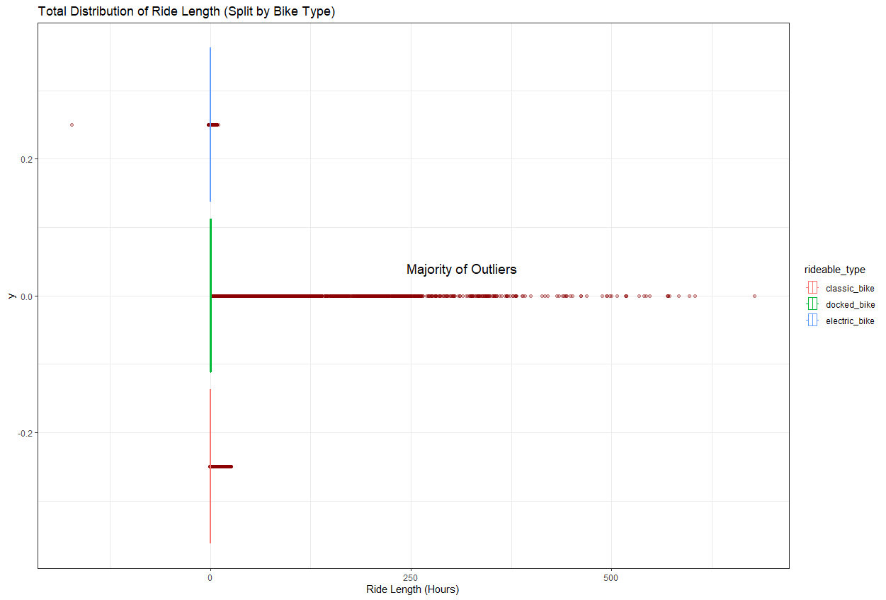
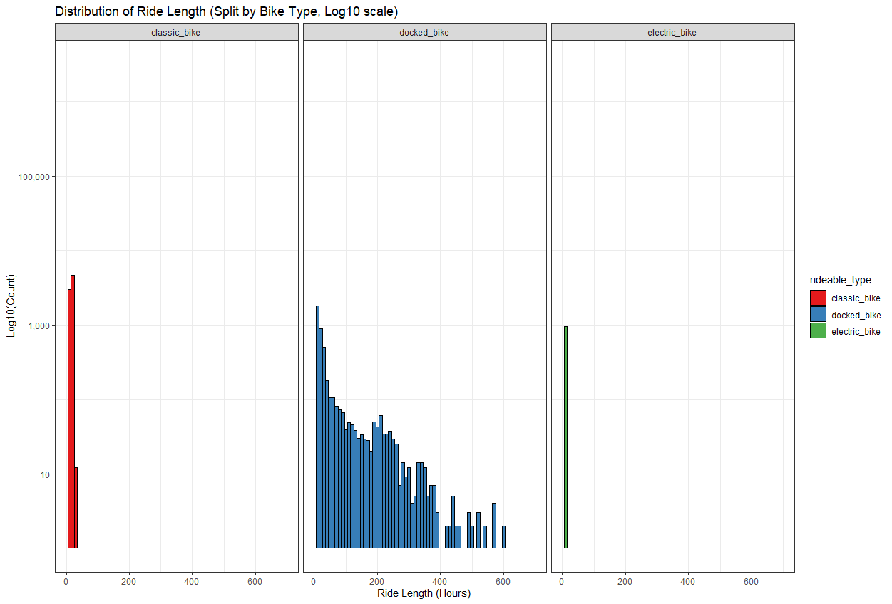
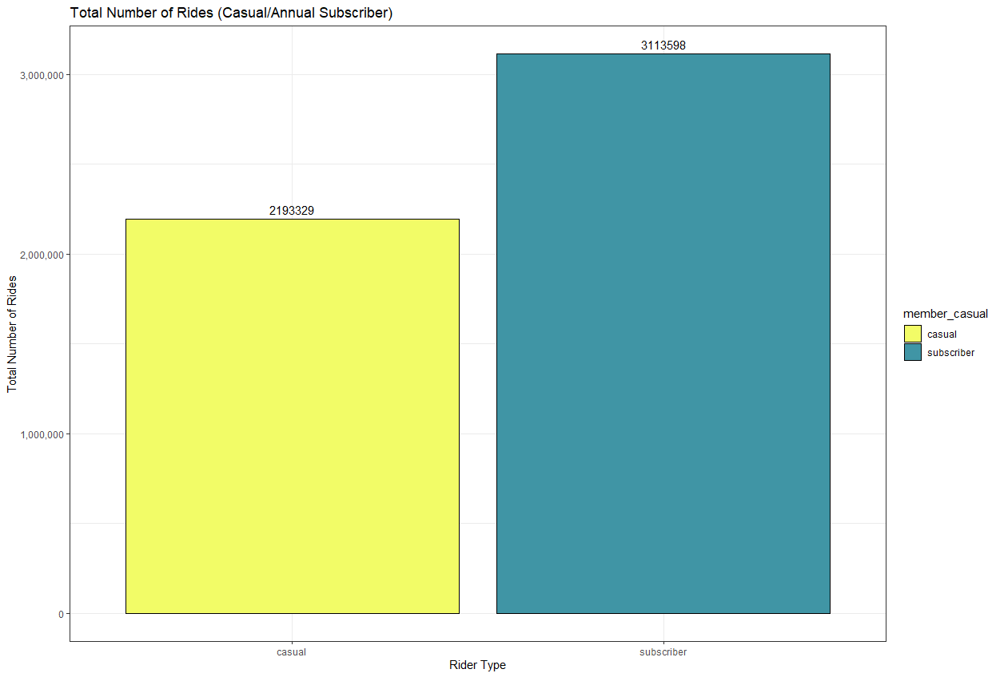
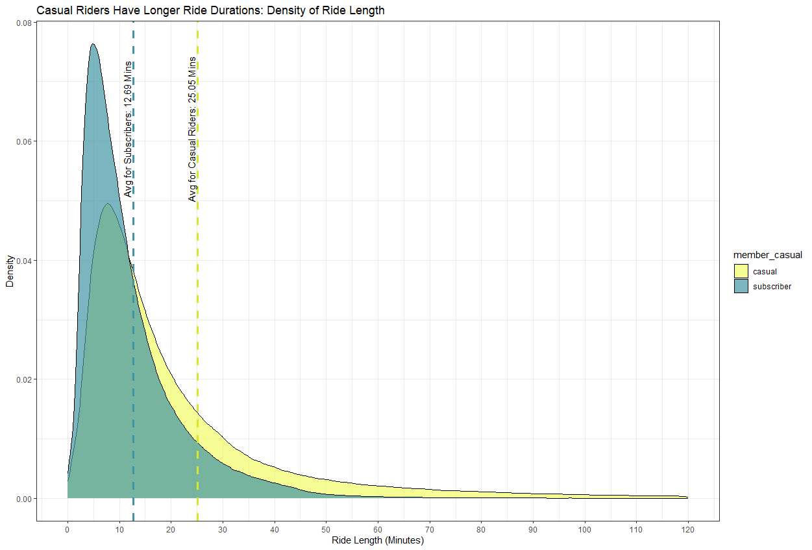
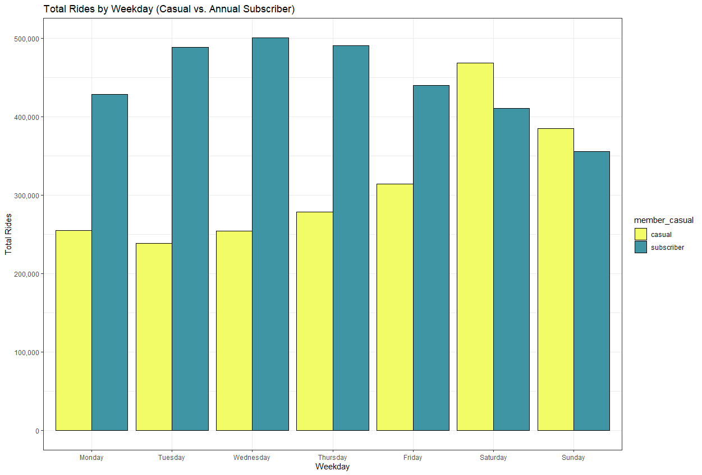
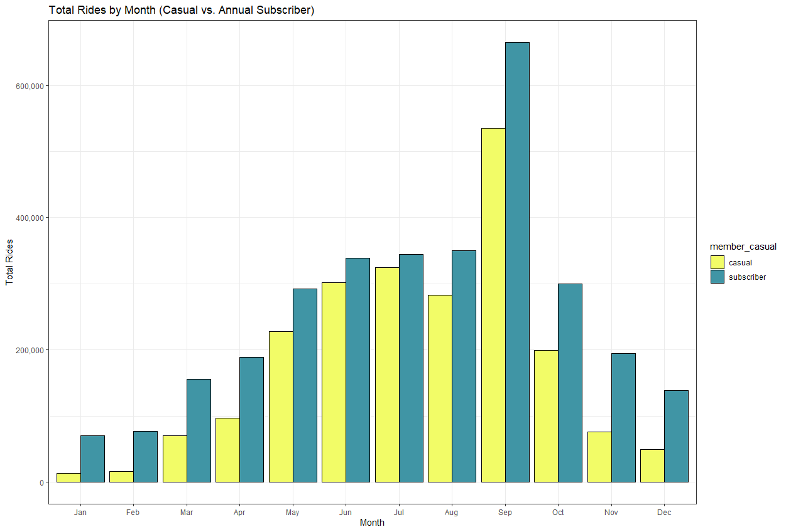

# Cyclistic Bike Share Analysis


- - - - - - - - - - - - - - - - - - - - - - - - - - - - - - - - - - - - - - - - - - - - - - - - - - - - - - - - - - 
# Introduction
This repository contains an analysis of data from **Cyclistic**, a fictional bike-share company based in Chicago. The overall objective is to uncover insights to develop a marketing strategy to convert casual riders into annual members. By analyzing Cyclistic’s bike trip data, we aim to understand how different types of customers use the service and identify opportunities to encourage casual riders to purchase annual memberships.

### The analysis will seek to answer the following questions:
1. How do the number of rides, average ride duration, and ride distance differ between casual riders and subscribing members?
2. Which days (e.g., weekdays vs. weekends) and seasons see the highest usage from casual riders and subscribing members?"
3. What are the most popular locations for casual riders?
4. Which bike types are most frequently used by casual riders, and how does this compare to those of subscribing members?
- - - - - - - - - - - - - - - - - - - - - - - - - - - - - - - - - - - - - - - - - - - - - - - - - - - - - - - - - - 
# Tools
- **Excel**: For CSV management
- **Git/GitHub**: For version control and uploading my findings
- **R**: For data wrangling, analysis, and visualization
- **RStudio**: The primary enviornment used for scripting


- - - - - - - - - - - - - - - - - - - - - - - - - - - - - - - - - - - - - - - - - - - - - - - - - - - - - - - - - - 
# Data Source
The analysis is based on **Cyclistic’s** CSV trip data, which includes information about each ride taken with the service over the past year. The dataset covers various aspects of the rides, such as start/end times, station names, ride length, and user type (casual or subscribing member). You can access the updated data souce [here](https://divvy-tripdata.s3.amazonaws.com/index.html) or within the [data folder](data) of this repository.


- - - - - - - - - - - - - - - - - - - - - - - - - - - - - - - - - - - - - - - - - - - - - - - - - - - - - - - - - - 
# Data Preparation and Cleanup
The script includes steps for loading, cleaning, and preparing the data for analysis. This involves merging multiple CSV files, handling missing values, identifying outliers, and creating new variables for analysis.


## Load Libraries #################################################
To start, we load the necessary libraries for our analysis. These libraries provide functions for data manipulation, visualization, and spatial analysis.
<details>
<summary>Click to view code</summary>

```r
library(geosphere)
library(leaflet)
library(leaflet.extras)
library(tidyverse)
theme_set(theme_bw())
```
</details> 


## Importing Data #################################################
The data was originally divided into 13 CSV files, which were merged using the following code. This process involves importing the files into a list, evaluating their structure, and combining them into a single data frame. The data was then verified to be structurally sound before proceeding with the analysis.

**Key things to note:**
- No duplications within the primary key (ride_id)
- Total of 6,584,382 rows
#### Preview of all_trips Dataframe

| ride_id         | rideable_type | started_at          | ended_at            | start_station_name | start_station_id | end_station_name | end_station_id | start_lat | start_lng | end_lat  | end_lng  | member_casual |
|-----------------|---------------|---------------------|---------------------|--------------------|------------------|------------------|----------------|-----------|-----------|----------|----------|---------------|
| 9DC7B962304CBFD8 | electric_bike | 2021-09-28 16:07:10 | 2021-09-28 16:09:54 | NA                 | NA               | NA               | NA             | 41.89000  | -87.68000 | 41.89000 | -87.67000 | casual        |
| F930E2C6872D6B32 | electric_bike | 2021-09-28 14:24:51 | 2021-09-28 14:40:05 | NA                 | NA               | NA               | NA             | 41.94000  | -87.64000 | 41.98000 | -87.67000 | casual        |
| 6EF72137900BB910 | electric_bike | 2021-09-28 00:20:16 | 2021-09-28 00:23:57 | NA                 | NA               | NA               | NA             | 41.81000  | -87.72000 | 41.80000 | -87.72000 | casual        |
| 78D1DE133B3DBF55 | electric_bike | 2021-09-28 14:51:17 | 2021-09-28 15:00:06 | NA                 | NA               | NA               | NA             | 41.80000  | -87.72000 | 41.81000 | -87.72000 | casual        |
| E03D4ACDCAEF6E00 | electric_bike | 2021-09-28 09:53:12 | 2021-09-28 10:03:44 | NA                 | NA               | NA               | NA             | 41.88000  | -87.74000 | 41.88000 | -87.71000 | casual        |
| 346DE323A2677DC0 | electric_bike | 2021-09-28 01:53:18 | 2021-09-28 02:00:02 | NA                 | NA               | NA               | NA             | 41.87000  | -87.75000 | 41.88000 | -87.74000 | casual        |
| 558CE7087B42D8DB | electric_bike | 2021-09-28 07:15:56 | 2021-09-28 07:38:25 | NA                 | NA               | NA               | NA             | 41.74000  | -87.63000 | 41.74000 | -87.56000 | casual        |
| 3EF7CB1851930A1F | electric_bike | 2021-09-28 11:17:00 | 2021-09-28 11:40:17 | NA                 | NA               | NA               | NA             | 41.74000  | -87.56000 | 41.75000 | -87.63000 | casual        |
| 1F9A9A6BA4C2F82E | electric_bike | 2021-09-27 19:57:09 | 2021-09-27 20:09:08 | NA                 | NA               | NA               | NA             | 41.95000  | -87.76000 | 41.95000 | -87.76000 | casual        |
| CAA3791DE7300B8E | electric_bike | 2021-09-28 11:01:26 | 2021-09-28 11:22:56 | NA                 | NA               | NA               | NA             | 41.93000  | -87.69000 | 41.95000 | -87.75000 | casual        |

<details>
<summary>Click to view code</summary>

``` r
# Load all the trip files into a list
triplist <- list.files(pattern = "*.csv")

# Import data
all_trips <- map(triplist, read_csv)

# Evaluate the data structure before merging the list
glimpse(all_trips)

# Combine data into a single data frame
all_trips <- bind_rows(all_trips)

# Verify ride_id is a unique primary key
anyDuplicated(all_trips$ride_id)

# Re-evaluate structure
head(all_trips)
summary(all_trips)
str(all_trips)
View(all_trips)
```
</details>


## Data Wrangling #################################################
### Extrapolation of Dates and Ride Length
To prepare for analysis of temporal trends and ride characteristics, several new columns were created:
- **Month** and **Weekday** were extracted from the ride start time to analyze seasonal and weekly patterns.
- **Ride Length** was calculated as the duration of each ride in seconds to compare usage behaviors.
- The term **"members"** was renamed to **"subscribers"** for greater clarity and consistency with the business goal of converting casual riders into subscribing members.


<details>
<summary>Click to view code</summary>

``` r
# Extrapolation of dates
all_trips$date <- as.Date(all_trips$started_at)
all_trips$weekday <- weekdays(all_trips$started_at)
all_trips$month <- month(all_trips$started_at, label = T)
all_trips$year <- year(all_trips$started_at)

# Convert weekday into a factor, ensuring days are analyzed in a logical sequence rather than alphabetically.
all_trips$weekday <- ordered(all_trips$weekday,
                             levels = c("Monday","Tuesday","Wednesday","Thursday","Friday","Saturday","Sunday"))

# Verify the class of our weekday variable
class(all_trips$weekday)

# Calculate ride length
all_trips$ride_length_sec <- difftime(all_trips$ended_at, all_trips$started_at)

# convert ride_length_sec to numeric format
all_trips$ride_length_sec <- as.numeric(all_trips$ride_length_sec)

# rename member to subscriber
all_trips <- all_trips %>%
  mutate(member_casual = recode(member_casual,"member" = "subscriber"))
```
</details>


### Addressing Missing Station Names #################################################
To enhance data accuracy and completeness, missing station names and IDs were populated using the coordinates of known stations. This process ensured that:
- Missing start and end station names/IDs were filled when possible using station coordinates.
- Stations with ambiguous coordinates (e.g., multiple stations sharing the same coordinates) were excluded to maintain data reliability.

#### Recovered Stations Names and Id's
| Data Frame            | start_station_name | start_station_id | end_station_name | end_station_id |
|-----------------------|--------------------|------------------|------------------|----------------|
| all_trips             | 988,145            | 988,143          | 1,057,488        | 1,057,488      |
|   all_trips2          | 759,720            | 759,718          | 817,437          | 817,437        |
| `Difference`          | **228,425**        | **228,425**      | **240,051**      | **240,051**    |

<details>
<summary>Click to view code</summary>

``` r
# Identify the number of NA values in the dataset
colSums(is.na(all_trips))

# Create lists of start and end stations with their coordinates
start_station_list <- all_trips %>%
  filter(!is.na(start_station_name)) %>% 
  distinct(start_station_id, start_lat, start_lng, .keep_all = T) %>%
  select(station_id = start_station_id,
         station_name = start_station_name,
         lat = start_lat,
         lng = start_lng)

end_station_list <- all_trips %>%
  filter(!is.na(end_station_name)) %>% 
  distinct(end_station_id, end_lat, end_lng, .keep_all = T) %>% 
  select(station_id = end_station_id,
         station_name = end_station_name,
         lat = end_lat,
         lng = end_lng)

# Combine start and end station lists
full_station_list <- bind_rows(start_station_list, end_station_list)

# Filter to ensure unique station names per coordinate pair
full_station_list <- full_station_list %>% 
  group_by(lat, lng) %>% 
  filter(n_distinct(station_id) == 1) %>% 
  summarize(station_id = first(station_id),
            station_name = first(station_name)) %>% 
  ungroup()

# Join with the main dataset to recover missing start station names and IDs
all_trips2 <- left_join(all_trips, full_station_list,
                        by = c("start_lat" = "lat",
                               "start_lng" = "lng"))

# Coalesce joined start station names
all_trips2 <- all_trips2 %>%
  mutate(start_station_name = coalesce(start_station_name, station_name),
         start_station_id = coalesce(start_station_id, station_id)) %>% 
  select(-station_name, -station_id)

# Join with the main dataset to recover missing end station names and IDs
all_trips2 <- left_join(all_trips2, full_station_list,
                        by = c("end_lat" = "lat", "end_lng" = "lng"))

all_trips2 <- all_trips2 %>% 
  mutate(end_station_name = coalesce(end_station_name, station_name),
         end_station_id = coalesce(end_station_id, station_id)) %>% 
  select(-station_name, -station_id)

# printing total amount of recovered station names and id's
print(colSums(is.na(all_trips)))
print(colSums(is.na(all_trips2)))
```
</details>


### Identifying Extreme Outliers #################################################
After reviewing the overall data significant outliers were identified in ride length, with values exceeding typical ride durations. Suggesting potential data entry errors and the need for careful handling of extreme outliers.

#### Ride Length Distribution Summary (Seconds)
<details>
<summary>Click to view code</summary>

``` r
# Distribution of ride length
summary(all_trips2$ride_length_sec)
```
</details>

| Min.    | 1st Qu. | Median | Mean  | 3rd Qu. | Max.     |
|---------|---------|--------|-------|---------|----------|
| -621,201| 362     | 640    | 1,182 | 1,150   | 2,442,301|


#### 4th Quartile Ride Length Percentiles (Seconds)
<details>
<summary>Click to view code</summary>

``` r
# Calculate percentiles for ride length in groups of 0.05
fourth_quar_ride_length <- quantile(all_trips2$ride_length_sec, probs = c(.80, .85, .90, .95, .99, .998, .999, 1))
```
</details>

| Percentile | 80%    | 85%    | 90%    | 95%    | 99%    | 99.8%   | 99.9%   | 100%      |
|------------|--------|--------|--------|--------|--------|---------|---------|-----------|
| Value      | 1,335  | 1,589  | 1,981  | 2,811  | 6,611  | 18,122  | 67,331  | 2,442,301 |


#### Boxplot of Ride Distribution
The boxplot below portrays the distribution of ride lengths, segmented by bike type. It clearly illustrates how **extreme outliers distort the dataset**.
- The extreme outliers, marked in red, are significantly larger than the interquartile range (IQR), skewing the overall representation of ride lengths.
- These outliers predominantly affect the docked bike category, suggesting possible data recording issues or anomalies specific to this type.


<details>
<summary>Click to view code</summary>

``` r
# creating a boxplot of ride distrubtion
ggplot(all_trips2, aes(x = ride_length_sec/3600, color = rideable_type)) +
  geom_boxplot(outlier.color = "darkred", alpha = 0.3) +
  labs(title = "Total Distribution of Ride Length (Split by Bike Type)",
       x = "Ride Length (Hours)") +
  annotate("Text", x = 312, y = 0.04, label = " Majority of Outliers", size = 5)
```
</details>


#### Distribution By Bike Type
This histogram highlights the ride length distribution for each bike type on a log scale, providing a clear view of the **disparity between docked bikes** and the other bike types. 


<details>
<summary>Click to view code</summary>

``` r
# Creating log distrubtion of ride length by bike type chart
ggplot(all_trips2, aes(x = ride_length_sec/3600, fill = rideable_type)) +
  geom_histogram(binwidth = 10, color = "black") +
  labs(title = "Distribution of Ride Length (Split by Bike Type, Log10 scale)",
       x = "Ride Length (Hours)",
       y = "Log10(Count)") +
  scale_y_log10(labels = scales::comma_format()) + 
  xlim(0, 700) +
  facet_wrap(~rideable_type) +
  scale_fill_brewer(palette = "Set1")
```
</details>


#### Cleaning Erroneous Data and Calculating Distance
Additional data cleaning was conducted to address invalid trips and calculate the distances traveled:

- **Distance Calculation:** The Haversine formula was applied to calculate the straight-line (Euclidean) distance between start and end points for each ride.
- **Filtering Invalid Trips:** The following were identified as invalid and excluded:
  1. Rides with non-positive durations.
  2. Rides with zero distances lasting 60 seconds or less.
  3. Rides originating from the test station: *Pawel Bialowas - Test- PBSC charging station*
- **Handling Missing Values:** NA values and flagged invalid trips were removed to ensure data consistency.

<details>
<summary>Click to view code</summary>

``` r
# Calculate the distance using the Haversine formula (Output is in meters)
# This is euclidean distance and is not a reflection of of road network distance
all_trips2 <- all_trips2 %>%
  rowwise() %>% 
  mutate(geo_distance_meters = distHaversine(c(start_lng, start_lat), c(end_lng, end_lat)))

# Filter and examine erroneous data
invalid_trips <- all_trips2 %>% 
  filter((ride_length_sec <= 0 |
            (geo_distance_meters == 0 & ride_length_sec <= 60)) |
           start_station_name == "Pawel Bialowas - Test- PBSC charging station")
View(invalid_trips)

# After review, remove NA values and erroneous trips
all_trips3 <- all_trips2 %>%
  na.omit() %>%
  anti_join(invalid_trips, by = "ride_id")
```
</details>


- - - - - - - - - - - - - - - - - - - - - - - - - - - - - - - - - - - - - - - - - - - - - - - - - - - - - - - - - - 
# Analysis
### General Statistics
Before diving into specific questions, here are some general statistics about the dataset, to provide an overview of Cyclistic's bike-sharing usage:

| Metric                                  | Value      |
|-----------------------------------------|------------|
| Total Number of Rides                   | 5,306,927  |
| Median Ride Length (Minutes)            | 10.98333   |
| Average Ride Length (Minutes)           | 17.82178   |
| Average Ride Distance (Euclidean Miles) | 1.330376  |

<details>
<summary>Click to view code</summary>

```r
general_summary <- all_trips3 %>%
  group_by() %>%
  summarize("Total Number of Rides" = n(),
            "Median Ride Length (Minutes)" = median(ride_length_sec/60),
            "Average Ride Length (Minutes)" = mean(ride_length_sec/60),
            "Average Ride Distance (Euclidean Miles)" = mean(geo_distance_meters*.00062137))
View(general_summary)
```
</details>


### 1. How do the number of rides, average ride duration, and ride distance differ between casual riders and subscribing members? #################################################

**Key observations:**

- Subscribers account for approximately 59% of the rides, while casual riders contribute 41%.
- Casual riders have rides that are nearly twice as long as those of subscribers on average.
- Both groups travel similar average distances, but casual riders cover slightly more.


#### Ride Count
The bar chart below highlights the **total number of rides** taken by each rider type. Subscribers have a significantly higher ride count, aligning with their more regular usage patterns.


<details>
<summary>Click to view code</summary>

```r
# 1a. Ride Count bar chart (Casual/Subscriber)
ggplot(member_summary, aes(x = member_casual, y = `Total Rides`, fill = member_casual)) +
  geom_col(color = "black") +
  geom_text(aes(label = `Total Rides`), vjust = -0.5, size = 4) +
  labs(title = "Total Number of Rides (Casual/Annual Subscriber)",
       x = "Rider Type",
       y = "Total Number of Rides") +
  scale_y_continuous(labels = scales::comma_format()) +
  scale_fill_manual(values = c("casual" = "#F2FC67", "subscriber" = "#4095A5"))
```
</details>

#### Ride Length
The density chart below shows the distribution of ride durations. Casual riders consistently have longer rides, with their **average duration (25.05 minutes)** nearly doubling that of **subscribers (12.69 minutes)**.


<details>
<summary>Click to view code</summary>

``` r
# 1b.Avg Ride Length
ggplot(all_trips3, aes(x = ride_length_sec / 60, fill = member_casual)) +
  geom_density(alpha = 0.7) +
  geom_vline(xintercept = 12.69740, linetype = "dashed", color = "#4095A5", size = 1.2) +
  geom_vline(xintercept = 25.05755, linetype = "dashed", color = "#D9E62C", size = 1.2) +
  annotate("text", x = 11.5, y = 0.062, label = "Avg for Subscribers: 12.69 Mins", angle = 90, color = "black") +
  annotate("text", x = 23.8, y = 0.062, label = "Avg for Casual Riders: 25.05 Mins", angle = 90, color = "black") +
  labs(title = "Casual Riders Have Longer Ride Durations: Density of Ride Length",
       x = "Ride Length (Minutes)",
       y = "Density") +
  scale_x_continuous(breaks = seq(0, 120, by = 10), limits = c(0, 120)) +
  scale_fill_manual(values = c("casual" = "#F2FC67", "subscriber" = "#4095A5"))
```
</details>


#### Ride Distance
Both casual riders and subscribers travel **similar average distances**, though casual riders travel slightly farther. This could be indicative of more leisurely or exploratory rides.


<details>
<summary>Click to view code</summary>

``` r
# 1c. Avg Ride Distance
ggplot(member_summary, aes(x = member_casual, y = `Avg Ride Distance (euclidean Miles)`, fill = member_casual)) +
  geom_col(color = "black") +
  geom_text(aes(label = round(`Avg Ride Distance (euclidean Miles)`, 2)), vjust = -0.5, size = 4) +
  labs(title = "Average Ride Distance (Straight-Line Miles)",
       x = "Rider Type",
       y = "Euclidean Miles") +
  scale_fill_manual(values = c("casual" = "#F2FC67", "subscriber" = "#4095A5"))
```
</details>


### 2. Which days (e.g., weekdays vs. weekends) and seasons see the highest usage from casual riders and subscribing members #######################
**Key Findings**


Weekdays vs. Weekends:

- Casual riders primarily use the service on weekends, reflecting recreational or leisure use.
- Subscribers show consistent usage throughout the week, indicating routine commutes or errands.


Seasonality:
- Casual riders show a strong preference for warmer months (May to September), with a significant decline in usage during winter.
- Subscribers maintain steady usage across all seasons, with slight increases during spring and summer.

#### Weekly Ride Count
The bar chart below illustrates the difference of total rides throughout the week between the two rider types.


<details>
<summary>Click to view code</summary>

``` r
# 2a. Bar chart for weekly ride count
ggplot(all_trips3 %>%
         group_by(member_casual, weekday) %>%
         summarize(total_rides = n()),
       aes(x = weekday, y = total_rides, fill = member_casual)) +
  geom_col(color = "black", position = "dodge") +
  labs(title = "Total Rides by Weekday (Casual vs. Annual Subscriber)",
       x = "Weekday",
       y = "Total Rides") +
  scale_y_continuous(labels = scales::comma_format()) +
  scale_fill_manual(values = c("casual" = "#F2FC67", "subscriber" = "#4095A5"))
```
</details>


#### Monthly Ride Count
This bar chart highlights seasonal trends in ride usage, showing peak usage in September. 


<details>
<summary>Click to view code</summary>

``` r
# 2b. Bar chart for monthly ride count
ggplot(all_trips3 %>%
         group_by(member_casual, month) %>%
         summarize(total_rides = n()),
       aes(x = month, y = total_rides, fill = member_casual)) +
  geom_col(color = "black", position = "dodge") +
  labs(title = "Total Rides by Month (Casual vs. Annual Subscriber)",
       x = "Month",
       y = "Total Rides") +
  scale_y_continuous(labels = scales::comma_format()) +
  scale_fill_manual(values = c("casual" = "#F2FC67", "subscriber" = "#4095A5"))
```
</details>


### 3. What are the most popular starting and ending locations for casual riders? ###############
**Key Findings**
- The most frequently used stations by casual riders are clustered around key recreational and high-traffic areas.
- Starting and ending stations are nearly identical, suggesting casual riders tend to return to their starting points or use stations located in highly popular areas.
- Popular stations stand out significantly in both total ride counts and geographic clustering.


#### Top 10 Stations Bar Chart
The bar chart below combines starting and ending locations into a single visualization to highlight the most frequently used stations by casual riders.


<details>
<summary>Click to view code</summary>

```r
# 3a. Top 10 stations
# since both start and end stations are identical, combine to condense presentation
# Combine start and end station counts into a single summary
popular_stations <- all_trips3 %>%
  filter(member_casual == "casual") %>%
  pivot_longer(cols = c(start_station_name, end_station_name), values_to = "station_name") %>%
  count(station_name, name = "total_rides", sort = TRUE) %>%
  slice_head(n = 10)

# Popular stations bar chart
ggplot(popular_stations, aes(x = reorder(station_name, total_rides), y = total_rides)) +
  geom_col(color = "black", fill = "#F2FC67") +
  coord_flip() +
  labs(title = "Top 10 Stations for Casual Riders (Start and End Combined)",
       x = "Station Name",
       y = "Total Rides") +
  scale_y_continuous(labels = scales::comma_format())
```
</details>


#### Popular Stations Map
The map below show the geographic distribution of the most popular stations for casual riders. These stations are emphasized in lime green to distinguish them from less frequently used locations.


<details>
<summary>Click to view code</summary>

```r
# 3b. popular station map
# Create a station list to have one set of coordinates per station
map_station_list <- full_station_list %>% 
  distinct(station_id, station_name, .keep_all = T)


# Add a flag to indicate whether each station is popular
map_station_list <- map_station_list %>%
  mutate(is_popular = ifelse(station_name %in% popular_stations$station_name, TRUE, FALSE))


# Create the combined map (popular stations in Lime)
stations_map_highlight <- leaflet(map_station_list) %>%
  addProviderTiles(provider = "Stadia.AlidadeSmoothDark") %>%
  setView(lng = -87.70, lat = 41.85,
          zoom = 11) %>%
  addCircleMarkers(
    lng = ~lng, lat = ~lat,
    popup = ~paste("Station Name: ", station_name),
    radius = ~ifelse(is_popular, 14, 2),
    color = ~ifelse(is_popular, "#F2FC67", "#577B8A"),
    fillOpacity = 0.9)
stations_map_highlight
```
</details>


### 4. Which bike types are most frequently used by casual riders, and how does this compare to those of subscribing members? #################################################
**Key Findings**
- Both casual riders and subscribers show similar rankings in bike type usage, with the primary difference being the proportion of electric vs. classic bike usage.
Bar Chart By Bike Type
- Docked bikes are the least used by both groups, reflecting limited availability or less convenience.

#### Bar Chart By Bike Type
The bar chart below displays the total rides for each bike type, categorized by rider type:


<details>
<summary>Click to view code</summary>

```r
# 4. Bike type
# Create a grouped bar chart by bike type
ggplot(all_trips3 %>%
    group_by(member_casual, rideable_type) %>%
    summarize(total_rides = n(), .groups = "drop") %>%
    mutate(rideable_type = reorder(rideable_type, -total_rides)),
  aes(x = rideable_type, y = total_rides, fill = member_casual)) +
  geom_col(color = "black", position = "dodge") +
  labs(title = "Bike Type Usage by Rider Type",
    x = "Bike Type",
    y = "Total Rides",
    fill = "Rider Type") +
  scale_y_continuous(labels = scales::comma_format()) +
  scale_fill_manual(values = c("casual" = "#F2FC67", "subscriber" = "#4095A5"))
```
</details>


- - - - - - - - - - - - - - - - - - - - - - - - - - - - - - - - - - - - - - - - - - - - - - - - - - 
# Conclusion
## Key Findings
#### General
- Ride usage peaks during warmer months, with September seeing the highest activity and January the lowest.
- Casual riders account for 41.32% of rides, while subscribers make up 58.67%.
- Classic bikes are the most popular choice for both groups, followed by electric bikes.
- Outliers in ride length, especially for docked bikes, highlight potential data accuracy issues.

#### Casual Riders
- Casual riders average longer trips at 25 minutes compared to 12 minutes for subscribers.
- Casual users dominate weekend rides, showing greater variability and are likely due to recreational use.

#### Annual Subscribing Members
- Subscribers consistently use the service throughout the week, with no significant drop-off between weekdays and weekends.
- Annual subscribing members consistently use the service for shorter, more frequent rides, indicating commuting or routine travel.


## Recommendations 
#### 1. Introduce Additional Membership Options

Introduce flexible membership options that would cater towards current casual riders. A tier membership that would allow for weekend riders to subscribe to "Weekend Memberships or “Seasonal Passes” could leverage peak times for the casual base.

#### 2. Enhance Access to Preferred Bike Types

While classic bikes are the most used, this may be due to limited availability of electric bikes. By verifying rider preferences and ensuring a sufficient supply of preferred bikes at key locations, we can attract more riders and improve satisfaction.

#### 3. Promote a Sense of Community

Create engaging features that allow riders to track and share ride statistics, achievements, or distances. Casual riders may find value in competing with friends or unlocking rewards for completing milestones. 

#### 4. Offer Exclusive Perks for Subscribers
Provide added value for subscribers through benefits like priority access to electric bikes or discounts at businesses near high-traffic stations. This could make it more appealing for casual riders to considering an upgrade.